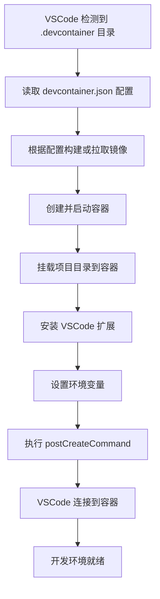

# DevContainer 工作原理详解

## 目录
1. [DevContainer 启动流程](#1-devcontainer-启动流程)
2. [文件挂载机制](#2-文件挂载机制)
3. [devcontainer.json 配置解析](#3-devcontainerjson-配置解析)
4. [Dockerfile 构建过程](#4-dockerfile-构建过程)
5. [容器内文件系统](#5-容器内文件系统)
6. [开发工作流详解](#6-开发工作流详解)
7. [常见问题与排查](#7-常见问题与排查)

## 1. DevContainer 启动流程

### 当您点击 "Reopen in Container" 时发生了什么？



### 详细步骤说明

#### 步骤 1：配置解析
- VSCode 查找 `.devcontainer/devcontainer.json` 文件
- 解析配置内容：
  ```json
  {
    "build": {
      "dockerfile": "Dockerfile",
      "context": ".."  // 构建上下文是项目根目录
    }
  }
  ```

#### 步骤 2：镜像构建
- 使用指定的 Dockerfile 构建镜像
- 构建上下文设置为 `..`（项目根目录）
- 生成的镜像通常标记为类似 `vsc-devcontainer-xxxx`

#### 步骤 3：容器创建
- 基于构建的镜像创建新容器
- 配置网络、端口转发等
- 设置容器名称（如 `dev_ctr_hello-xxxx`）

#### 步骤 4：文件系统挂载
- 挂载项目文件到容器内部
- 配置卷挂载和绑定挂载

## 2. 文件挂载机制

### 默认挂载行为

#### 1. 项目源代码挂载
```json
// devcontainer.json 中的默认配置
"workspaceFolder": "/workspace"
```

实际执行时等同于：
```bash
docker run -v /本地项目路径:/workspace container_image
```

#### 2. VSCode Server 挂载
```bash
-v /本地/.vscode-server:/root/.vscode-server  # 或 /home/vscode/.vscode-server
```

#### 3. Docker Socket 挂载（如果需要）
```bash
-v /var/run/docker.sock:/var/run/docker.sock
```

### 挂载类型详解

#### Bind Mount（绑定挂载）
```json
{
  "mounts": [
    "source=/本地路径,target=/容器路径,type=bind"
  ]
}
```

特点：
- 直接映射本地文件系统
- 实时同步修改
- 适合源代码开发

#### Volume（数据卷）
```json
{
  "mounts": [
    "source=volume_name,target=/容器路径,type=volume"
  ]
}
```

特点：
- 由 Docker 管理
- 持久化存储
- 适合数据库存储

#### Tmpfs（临时文件系统）
```json
{
  "mounts": [
    "type=tmpfs,destination=/tmp"
  ]
}
```

特点：
- 内存中存储
- 容器停止后数据丢失
- 适合临时文件

### 特殊文件的处理

#### .gitignore 风格的排除
创建 `.devcontainer/devcontainer.json`：
```json
{
  "workspaceMount": "src=${localWorkspaceFolder},target=/workspace,type=bind,consistency=cached",
  "workspaceFolder": "/workspace"
}
```

### 实际挂载示例

以本项目为例，实际执行的命令类似于：
```bash
docker run -it --name dev_ctr_hello-12345 \
  -v "d:\\code\\a_go\\proj\\dev_ctr_hello:/workspace:cached" \
  -v "/var/run/docker.sock:/var/run/docker.sock" \
  -p 8080:8080 \
  -e GOPROXY=https://goproxy.cn,direct \
  golang:1.25-bookworm \
  sleep infinity
```

## 3. devcontainer.json 配置解析

### 核心配置项

#### build 配置
```json
{
  "build": {
    "dockerfile": "Dockerfile",    // 相对于 .devcontainer 目录
    "context": "..",              // 构建上下文
    "args": {                     // 构建参数
      "VARIANT": "1.25"
    },
    "target": "development"       // 多阶段构建目标
  }
}
```

#### 运行时配置
```json
{
  "name": "Go DevContainer",
  "workspaceFolder": "/workspace",      // 容器内工作目录
  "workspaceMount": "src=${localWorkspaceFolder},target=/workspace,type=bind",
  "remoteUser": "vscode",               // 远程用户
  "runArgs": [                          // 额外的 docker run 参数
    "--cap-add=SYS_PTRACE",
    "--security-opt=seccomp:unconfined"
  ]
}
```

#### 端口转发
```json
{
  "forwardPorts": [8080, 3000],
  "portsAttributes": {
    "8080": {
      "label": "Gin App",
      "onAutoForward": "notify"
    }
  }
}
```

#### 生命周期命令
```json
{
  "onCreateCommand": "echo 'Container created'",
  "postCreateCommand": "make init",
  "postStartCommand": "make run",
  "postAttachCommand": "echo 'VSCode attached'"
}
```

## 4. Dockerfile 构建过程

### 我们的 Dockerfile 解析

```dockerfile
# 第一阶段：基础环境
FROM golang:1.25-bookworm

# 设置环境变量（全局有效）
ENV GO111MODULE=on
ENV GOPROXY=https://goproxy.cn,direct
ENV GIN_MODE=debug

# 第二阶段：用户配置
RUN if id "vscode" >/dev/null 2>&1; then \
    echo "User vscode already exists"; \
  else \
    useradd -m -s /bin/bash vscode && \
    usermod -aG sudo vscode && \
    echo "vscode ALL=(ALL) NOPASSWD:ALL" >> /etc/sudoers; \
  fi

# 第三阶段：工具安装
RUN apt-get update && \
    apt-get install -y make git vim tree && \
    apt-get clean

# 第四阶段：工作目录设置
WORKDIR /workspace
RUN mkdir -p /workspace/{cmd,internal,pkg,configs}
RUN chown -R vscode:vscode /workspace

# 第五阶段：用户切换
USER vscode
CMD ["sleep", "infinity"]
```

### 构建优化技巧

#### 1. 层缓存优化
```dockerfile
# 好的做法：先安装依赖，再复制代码
COPY go.mod go.sum ./
RUN go mod download
COPY . .

# 避免：每次都重新安装依赖
COPY . .
RUN go mod download  # 每次代码改变都会重新执行
```

#### 2. 多阶段构建
```dockerfile
# 构建阶段
FROM golang:1.25 as builder
WORKDIR /app
COPY . .
RUN CGO_ENABLED=0 go build -o main

# 运行阶段
FROM gcr.io/distroless/static
COPY --from=builder /app/main /main
CMD ["/main"]
```

## 5. 容器内文件系统

### 文件系统结构

```
/workspace                          # 项目根目录（挂载的本地文件）
├── .devcontainer/                  # DevContainer 配置
│   ├── devcontainer.json          # 配置文件
│   └── Dockerfile                 # 构建文件
├── .vscode/                       # VSCode 配置（本地 .vscode 不被挂载）
├── main.go                        # 项目代码
├── go.mod                         # Go 模块文件
└── Makefile                       # Make 文件

/home/vscode/                      # 用户主目录
├── .vscode-server/               # VSCode Server 安装目录
├── .bashrc                       # Shell 配置
└── .profile                      # 用户配置

/root/                           # root 用户目录（如果有权限访问）
└── .vscode-server/              # 全局 VSCode Server

/                             # 系统根目录
├── usr/
│   └── local/
│       └── go/               # Go 安装目录
├── var/                       # 变量数据
├── tmp/                       # 临时文件
└── proc/                      # 进程信息
```

### 哪些文件被挂载？哪些不在？

#### ✅ 被挂载的文件（容器内修改会同步到本地）
- 项目源代码（除了 .devcontainer）
- `/workspace` 下的所有文件
- 包括：
  - main.go
  - go.mod/go.sum
  - Makefile
  - README.md
  - 自己创建的目录和文件

#### ❌ 不被挂载的文件（容器内独立）
- `.devcontainer` 目录
- 容器内的系统文件（/usr, /bin, /etc 等）
- VSCode Server 文件
- 容器内创建的 `/tmp`, `/var` 等系统目录

#### ⚠️ 特殊情况：.vscode 目录
```json
// 默认行为：本地 .vscode 不被挂载
"mounts": ["source=${localWorkspaceFolder},target=/workspace,type=bind,consistency=cached"]

// 如果想挂载本地 .vscode：
"mounts": [
  "source=${localWorkspaceFolder},target=/workspace,type=bind,consistency=cached",
  "source=${localWorkspaceFolder}/.vscode,target=/workspace/.vscode,type=bind"
]
```

## 6. 开发工作流详解

### 典型的开发场景

#### 场景 1：编辑代码
1. 在 VSCode 中编辑 `/workspace/main.go`
2. 文件保存在本地文件系统
3. 容器内通过绑定挂载看到修改
4. Go 语言服务器（gopls）检测到变化
5. 自动进行语法检查、代码补全等

#### 场景 2：运行程序
```bash
# 在 VSCode 终端中执行
make run
# 或
go run main.go
```
- 命令在容器内执行
- 使用容器内的 Go 环境
- 输出显示在 VSCode 终端

#### 场景 3：安装依赖
```bash
go get github.com/gin-gonic/gin
```
- 依赖下载到 `/go/pkg/mod`
- 这个目录通常不被挂载
- 但 go.mod/go.sum 会被同步到本地

#### 场景 4：构建二进制文件
```bash
make build
# 二进制文件在 bin/main
```
- bin/ 目录是本地文件
- 可以提交到 Git（如果需要）
- 也可以添加到 .gitignore

### 文件同步机制

#### 一致性模式（Consistency）
```json
{
  "mounts": [
    "source=/path,destination=/workspace,type=bind,consistency=cached"
  ]
}
```

模式说明：
- `consistent`: 实时同步（性能较差）
- `cached`: 优先性能，延迟同步（默认）
- `delegated`: 优先容器端性能

### 性能优化建议

#### 1. 合理使用挂载一致性
```json
// Windows 用户推荐
"mounts": [
  "source=${localWorkspaceFolder},target=/workspace,type=bind,consistency=cached"
]
```

#### 2. 排除不必要的文件
```bash
# 创建 .dockerignore
node_modules
.git
*.log
.DS_Store
```

#### 3. 使用本地卷缓存
```json
{
  "mounts": [
    "source=${localWorkspaceFolder}/.go/cache,target=/go/pkg/mod,type=volume"
  ]
}
```

## 7. 常见问题与排查

### 问题 1：文件不同步

**症状**：修改了本地文件，但容器内看不到

**排查步骤**：
```bash
# 1. 检查挂载是否正确
docker inspect container_name | grep Mounts

# 2. 检查文件权限
ls -la /workspace

# 3. 检查 Docker Desktop 设置
# Windows: Docker Desktop > Settings > Shared Drives
```

### 问题 2：权限问题

**症状**：容器内无法写入文件

**解决方案**：
```json
{
  "remoteUser": "vscode",
  "runArgs": ["--userns=keep-id"]
}
```

或在 Dockerfile 中：
```dockerfile
RUN chown -R vscode:vscode /workspace
USER vscode
```

### 问题 3：端口冲突

**症状**：端口转发失败

**解决方案**：
```json
{
  "forwardPorts": [8080],
  "portsAttributes": {
    "8080": {
      "onAutoForward": "notify"
    }
  }
}
```

或手动指定端口：
```json
{
  "appPort": 8081
}
```

### 问题 4：构建失败

**排查命令**：
```bash
# 查看构建日志
docker build -t test -f .devcontainer/Dockerfile .

# 进入调试模式
docker run -it --rm golang:1.25-bookworm bash
```

### 调试技巧

#### 1. 查看容器详细信息
```bash
docker ps -a
docker inspect container_name
```

#### 2. 进入容器调试
```bash
docker exec -it container_name bash
```

#### 3. 查看挂载点
```bash
docker exec -it container_name df -h
docker exec -it container_name mount
```

#### 4. 查看环境变量
```bash
docker exec -it container_name env
```

## 总结

理解 DevContainer 的工作原理有助于：

1. **高效开发**：知道文件如何同步，避免常见问题
2. **性能优化**：合理配置挂载策略
3. **问题排查**：快速定位和解决问题
4. **高级配置**：根据需要自定义开发环境

核心概念：
- **文件挂载**：本地 ↔ 容器的文件同步
- **构建流程**：Dockerfile → 镜像 → 容器
- **生命周期**：创建 → 启动 → 开发 → 停止
- **隔离性**：开发环境独立，不影响本地

通过 DevContainer，您可以：
- 保持开发环境一致性
- 避免本地环境污染
- 轻松切换项目环境
- 享受容器化带来的便利